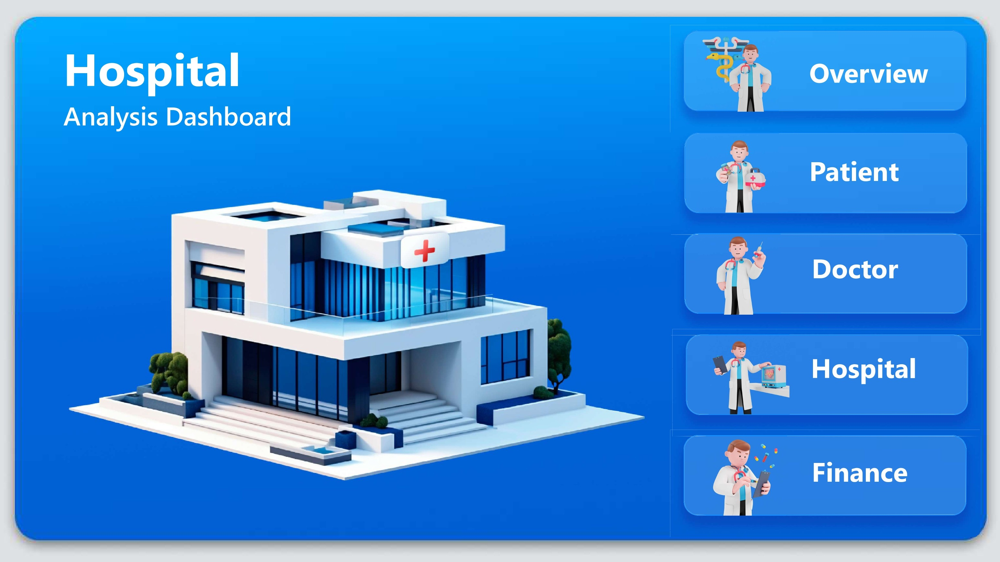
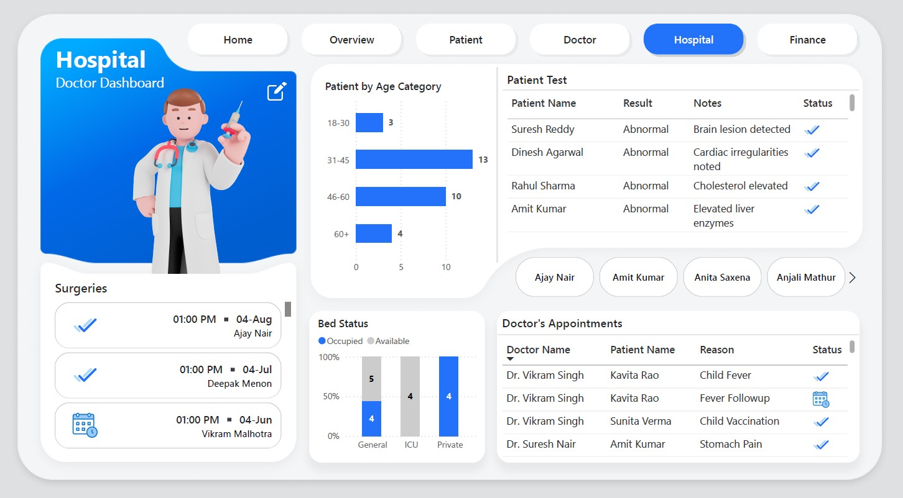
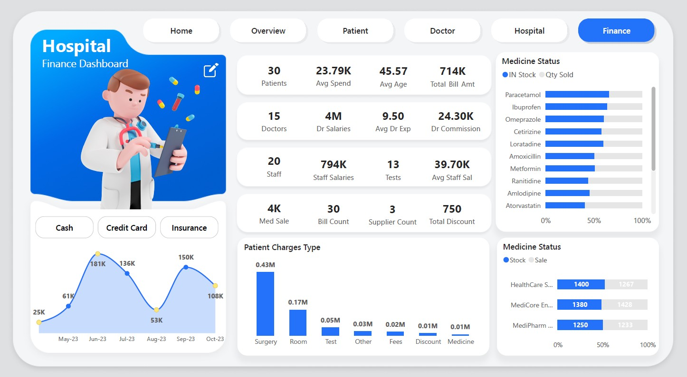

# 🏥 Hospital Analytics Dashboard
| Interactive Home Page | Overview |
|------------------|--------------------------|
|  |  |

---

## 📊 Key Features

* **Patient Analytics:** Admissions, discharges, age groups, avg spend, satisfaction  
* **Doctor Insights:** Fees, commissions, surgeries, workload tracking  
* **Financial Metrics:** Revenue, discounts, billing trends, avg patient spend  
* **Medicine & Inventory:** Stock vs. consumption, sales tracking  
* **Operational KPIs:** Appointment scheduling, test & surgery status, calendar analysis  

---

## 🖼️ Screenshots

| Patient Analytics | Doctor & Surgery Insights |
|------------------|--------------------------|
|  |  |

| Medicine & Inventory | Financial Metrics |
|--------------------|-----------------|
|  |  |

---

## 🛠️ Tools & Tech

* **Power BI**, **DAX**, **SQL**, **Excel/CSV**.
* Clean data model & scalable DAX measures.
* Status indicators & what-if analysis.

---

## 📈 Business Impact

* Enables **leadership** to monitor hospital performance instantly.
* Helps **doctors** track workload and commissions.
* Supports **finance & operations teams** with actionable insights.

---

## 👤 Author

**Krithi Sheregar** – Data Analyst | Power BI | SQL | Healthcare Analytics  
🔗 [GitHub](https://github.com/krithisheregar) | 🔗 [LinkedIn](https://www.linkedin.com/in/krithi-sheregar-5545071b9/)
